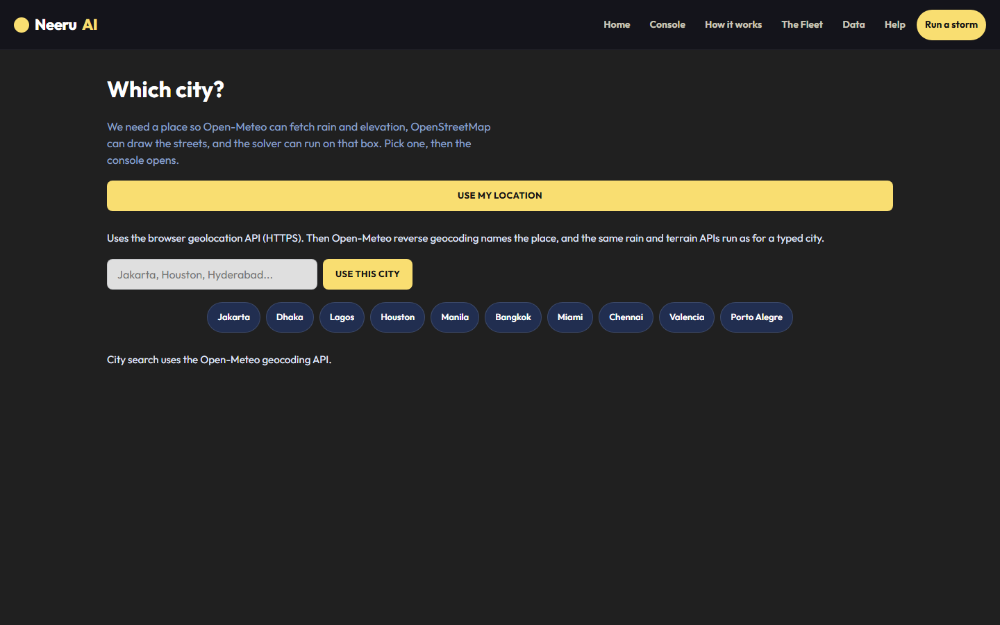
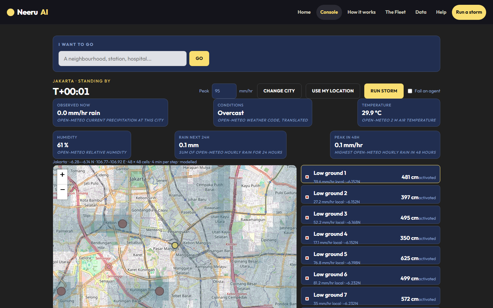
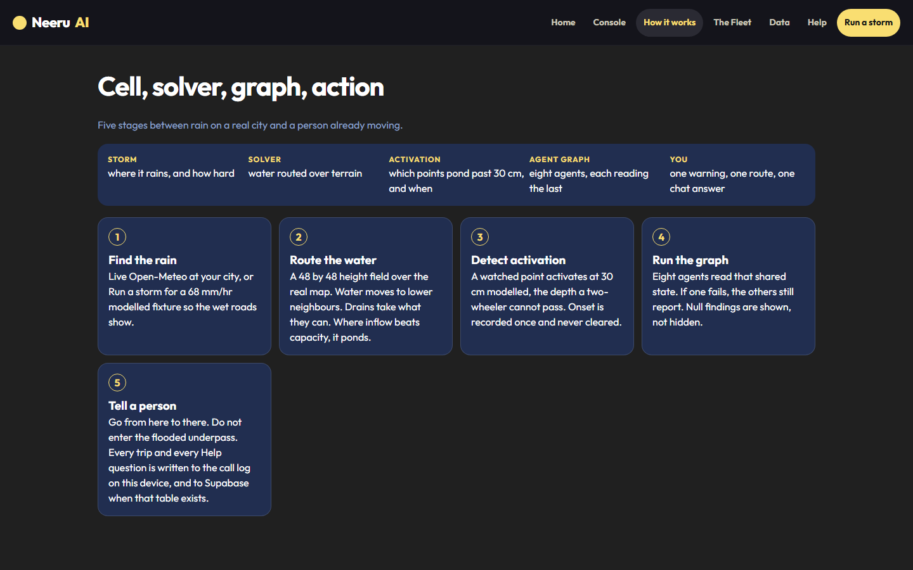
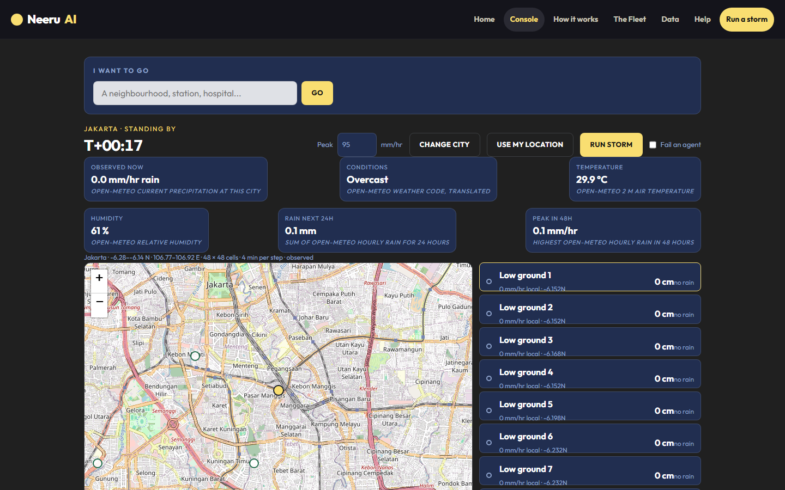

# Neeru AI

Flood desk. Real city, real rain, eight agents, one warning.

[Live](https://neeru-sigma.vercel.app/) · [GitHub Pages](https://anshul-real.github.io/neeru-AI/) · [Repo](https://github.com/ANSHUL-REAL/neeru-AI)










## Demo

1. Open the site.
2. **Run a storm** or **Console**.
3. **Use my location** or pick a city.
4. **Run storm** on the console if you want the heavy-rain model (95 mm/hr).
5. Ask **Where should I go next?**

```bash
npm install
npm test
npm run dev
```

`.env`: `OPENROUTER_API_KEY` for Help copy. `VITE_SUPABASE_URL` + `VITE_SUPABASE_ANON_KEY` for the call log (`supabase/schema.sql`).

## Stack

**AI Tinkerers** · **OpenRouter** · **OpenAI** (`gpt-4o-mini` through OpenRouter) · **Exa** (city flood research)

Open-Meteo (geocoding, reverse geocoding, elevation, live rain, temperature, humidity) · browser geolocation · OpenStreetMap + Leaflet · OSM Overpass · OSRM · Supabase · Vite · React · TypeScript · Vercel · GitHub Pages

| On screen | Source |
|---|---|
| City search / Use my location | Open-Meteo geocoding + browser geolocation |
| Map | OpenStreetMap |
| Rain, temp, humidity | Open-Meteo forecast |
| Depth, onset, agents | Local solver and agent graph |
| Go from A to B | OSRM around activated points |
| Help chat | OpenRouter → OpenAI, grounded in this map |
| Research | Exa search for flood reports in this city |
| Call log | Browser, and Supabase when configured |
