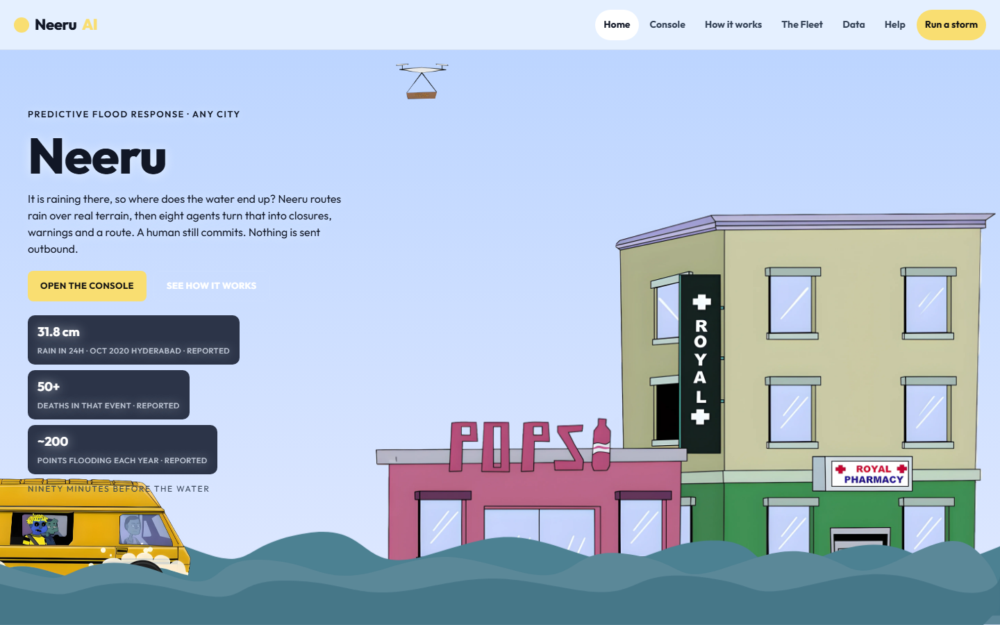

# Neeru



Live:

- https://neeru-sigma.vercel.app/
- https://anshul-real.github.io/neeru-AI/
- Repo: https://github.com/ANSHUL-REAL/neeru-AI

A flood desk for any city. Search a place, run a storm, see which roads pond, ask where to go next.

## Demo

1. Open the site.
2. Click **Run a storm** (or **Console**).
3. Pick a city (Houston, Jakarta, Hyderabad, or search).
4. The console should show depths, agents, and an approval queue. If it is still dry, click **Run storm** on the console (Peak 95 mm/hr modelled).
5. Ask **What should I do?** or **Where should I go next?**

## Run locally

```bash
npm install
npm test
npm run dev
```

Open http://127.0.0.1:5173/

Copy `.env.example` to `.env` for optional keys:

- `OPENROUTER_API_KEY` — Help chat and trip warnings via OpenRouter (`openai/gpt-4o-mini`). Without it, Help still answers from the map using a local fallback.
- `VITE_SUPABASE_URL` + `VITE_SUPABASE_ANON_KEY` — persist the call log. Run `supabase/schema.sql` first.

The solver, agents, and approval gate are local. Nothing is sent to the public.

## Products and tools used

Hackathon required list. Only items we actually wired are marked **used**. The rest were available and not integrated.

| Product | Used? | Where it sits in Neeru |
|---|---|---|
| **AI Tinkerers** | Event | Built for this hackathon |
| **OpenRouter** | Yes | Help chat, trip warning copy, operator brief. Server proxy `/api/openrouter`; model `openai/gpt-4o-mini` |
| **OpenAI** | Yes, through OpenRouter | Same Help/warning path. We do not call OpenAI’s API directly |
| CopilotKit | No | Not in the repo |
| Exa | No | Not in the repo |
| Trigger.dev | No | Not in the repo |
| Auth0 | No | Not in the repo |
| Mozilla.ai | No | Not in the repo |
| Ambiguous AI | No | Not in the repo |

### Also in the product (not on that list)

| Tool | Why |
|---|---|
| Open-Meteo | Geocoding, elevation DEM sample, live rain, temperature, humidity, 24h/48h forecast |
| OpenStreetMap + Leaflet | Real map tiles |
| Browser geolocation + Open-Meteo reverse | “Use my location” on the city picker and console |
| OSM Overpass | Tunnels and drains when the API answers in time |
| OSRM | Driving route and distance, then skip flooded points |
| Supabase | Optional call log (`call_log` table) |
| Vite + React + TypeScript | App |
| Vercel | Production host |
| GitHub Pages | Backup host |

## What each live call does

| You see | Why | API / code |
|---|---|---|
| City search | Need a place to run the model | Open-Meteo geocoding |
| Map | Real streets | OSM tiles via Leaflet |
| Observed rain / temp / humidity | Is a storm happening now | Open-Meteo forecast |
| Depth cm, draining / activated | 30 cm is a two-wheeler cutoff | Local height-field solver |
| Local mm/hr on each point | Rain is heavier near the storm centre | Modelled falloff from peak |
| Agents 8/8 | Specialists read one water graph | In-app, not a second API |
| Go from A to B | Path that skips flooded ground | OSRM + our flood points |
| Ask Neeru | What to do / where next | OpenRouter → OpenAI GPT-4o-mini, using only this map |
| Call log | History of storms, trips, questions | This browser; Supabase if configured |
